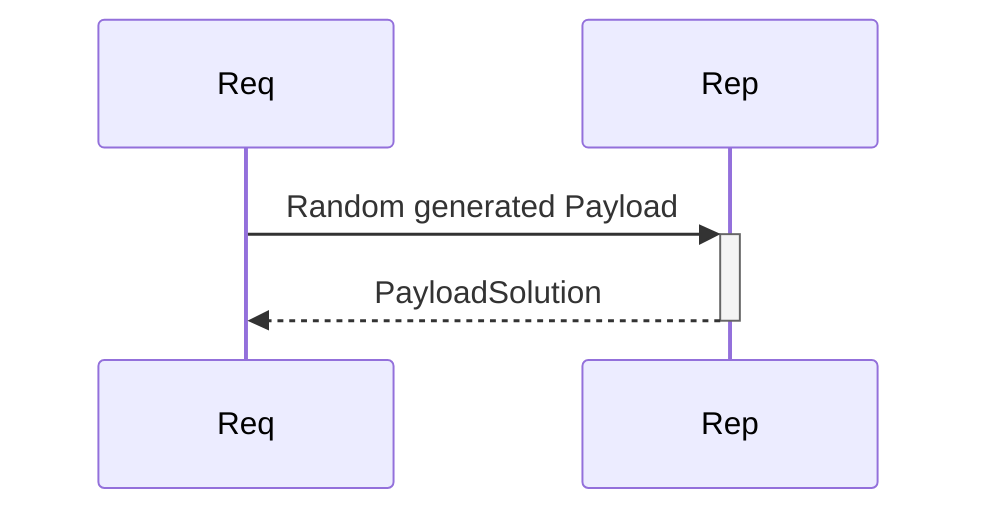
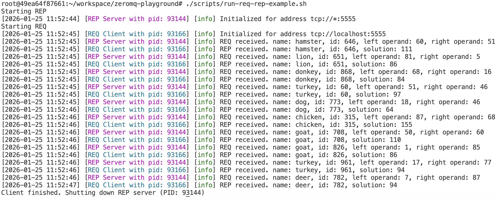
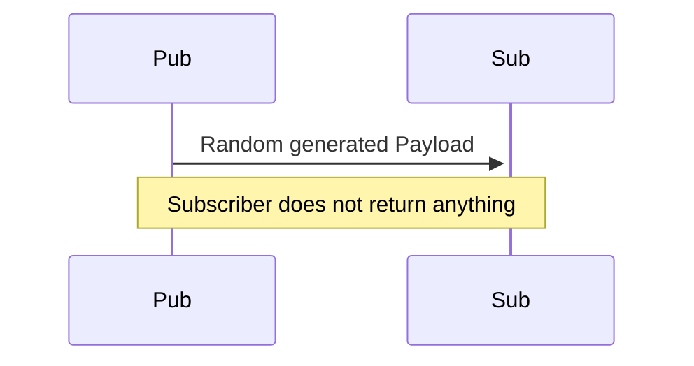
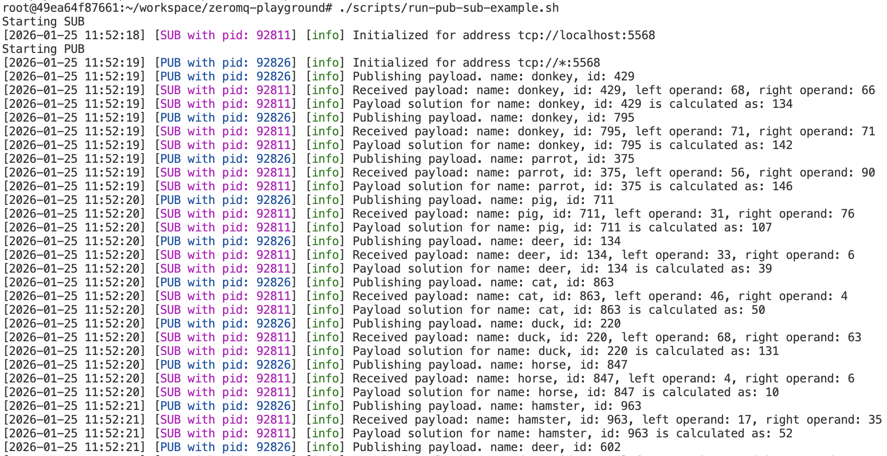
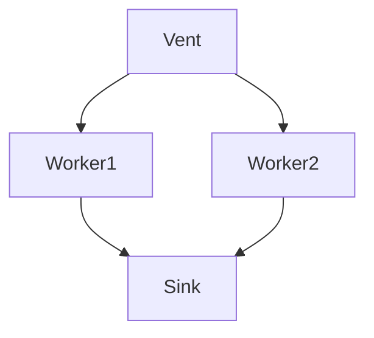
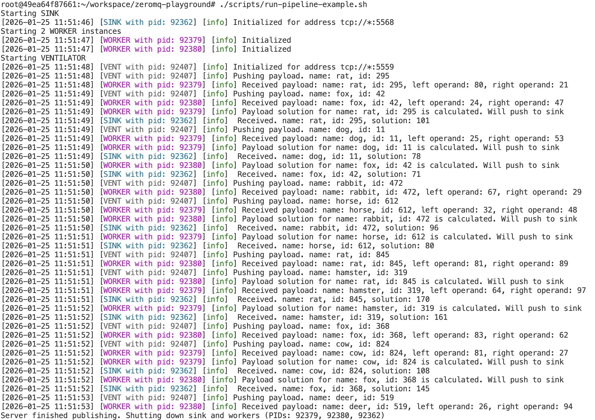

# zeromq-playground
Boilerplate code for myself regarding zeromq.

[ZeroMQ](https://zeromq.org) is an asynchronous high-performance messaging library that works brokerless. It supports a variety of messaging patters such as pub/sub, req/rep, client/server etc. over a variety of transport layers (TCP, in-process, inter-process, multicast, WebSocket and more).

This project is designed as a practice project as well as a boilerplate code for myself. It demonstrates a variety of capabilities of ZeroMQ using small modules. Information regarding modules and stuff can be found below or within the module directory.

## Messages

I used proto messages to send back and forth. Like a request and response message, there are **Payload** and **PayloadSolution**. I assumed **Payload.solution** attribute shall be equal to **Payload.left_operand + Payload.right_operand** for the same **payload_id** to simulate some sort of business logic. Message definitions are given below:

```
message Payload {
  string name = 1;
  int32 payload_id = 2;
  int32 left_operand = 3;
  int32 right_operand = 4;
}
````

```
message PayloadSolution {
    string name = 1;
    int32 payload_id = 2;
    int32 solution = 3;
}
```

## Patterns

### Request - Reply

Via `tcp://localhost:5555` a [Req](patterns/request-reply/include/req.hpp) instance make requests to a [Rep](patterns/request-reply/include/rep.hpp) instance. **Request** instance sends **Payload** messages and waits for **PayloadSolution** computed by **Reply** service.




**Example output:**



### Publish - Subscribe

 A [Pub](patterns/publish-subscribe/include/pub.hpp) instance publishes messages to`tcp://localhost:5568` while a [Sub](patterns/publish-subscribe/include/sub.hpp) instance subscribes to the same port. **Publisher** sends **Payload** messages and **Subscriber** listens these messages to create a **PayloadSolution** for its internal usage.



**Example output:**



### Pipeline

A [Ventilator](patterns/pipeline/include/ventilator.hpp) pushes its messages to `tcp://localhost:5559` while multiple [Worker](patterns/pipeline/include/worker.hpp)s pulls messages to do some operation on them. Workers push their messages to `tcp://localhost:5568` for a [Sink](patterns/pipeline/include/sink.hpp) to aggregate all processed messages. Again, briefly:

**Ventilator** creates **Payload**s and **PUSH** them to **Worker**s. **Worker**s **PULL** **Payload**s and create **PayloadSolutions** and **PUSH** them to **Sink**. **Sink** will **PULL** the **PayloadSolution**s from multiple workers.



**Example output:**



## Utils

[random_generator.hpp](utils/random_generator.hpp): Utility code to generate random [Payload](proto/payload.proto)s and integers to be used by clients.

[logger.hpp](utils/zeromq_logger.hpp): Colored loggers to be used when examining interprocess communication.

## Building and Running

Toolchain I use:

- **Compiler:** clang version 18.1.3
- **Build System:** CMake 4.2.1
- **Dependency Management:** [vcpkg](https://github.com/Microsoft/vcpkg)

**CMake** and **vcpkg** are prerequisities to fetch dependencies and build the project.

#### Dependencies:
- [cppzmq](https://github.com/zeromq/cppzmq)
- [spdlog](https://github.com/gabime/spdlog)
- [protobuf](https://protobuf.dev)

In order to get dependencies and build, below commands shall be executed:

*Get vcpkg first*
```
git clone https://github.com/microsoft/vcpkg "$HOME/vcpkg"
export VCPKG_ROOT="$HOME/vcpkg"
```

*Configure, fetch dependencies and build*
```
cmake -B build -S . -DCMAKE_TOOLCHAIN_FILE=$HOME/vcpkg/scripts/buildsystems/vcpkg.cmake
cmake --build build
```

*Install protoc manually for now*
```
sudo apt install -y protobuf-compiler libprotobuf-dev
```

You can either use executables under `build/` directory or scripts provided under [scripts/](scripts/) folder.

```
./scripts/run-pipeline-example.sh
./scripts/run-pub-sub-example.sh
./scripts/run-req-rep-example.sh
```


**CAUTION:** Scripts left zombie processes, I'll solve it later on. 

